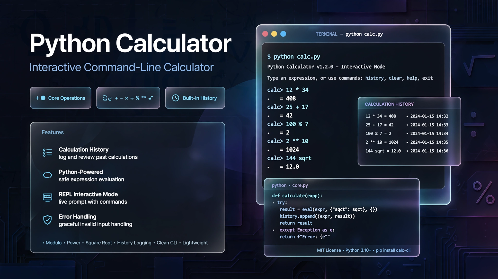

  

<h1 align="center">🧮 Python Calculator</h1>

  A command-line calculator built with Python for performing basic and advanced mathematical operations through an interactive terminal interface.

  
  
  
  

⸻

📌 Overview

Python Calculator is an interactive command-line application designed to practice and demonstrate fundamental Python programming concepts.

The calculator supports common arithmetic operations, mathematical functions, calculation history, and basic error handling.

The project focuses on writing clean, structured Python code while building a functional terminal-based application.

⸻

✨ Features

🧮 Mathematical Operations

* ➕ Addition
* ➖ Subtraction
* ✖️ Multiplication
* ➗ Division
* % Modulo
* ** Power
* √ Square Root

⚙️ Application Features

* 📜 Calculation history
* 🔁 Interactive command-line interface
* 🚫 Division-by-zero protection
* 🚫 Negative square-root protection
* ⚠️ Invalid input handling
* 🔄 Continuous calculations until the user exits

⸻

🛠️ Technologies

Technology	Purpose
🐍 Python 3	Application development
math	Mathematical functions
Git	Version control
GitHub	Repository & project management

⸻

📁 Project Structure

Calculator/
├── assets/
│   └── calculator-banner.png
├── calculator.py
├── README.md
└── .gitignore

Files

* calculator.py — Main calculator application.
* assets/calculator-banner.png — Project README hero banner.
* README.md — Project documentation.
* .gitignore — Prevents unnecessary Python files from being committed.

⸻

🚀 Getting Started

1. Clone the Repository

git clone https://github.com/Yassir050/Calculator.git

2. Enter the Project Directory

cd Calculator

3. Run the Calculator

python calculator.py

No external Python packages are required.

⸻

💻 Usage

When the application starts, an interactive menu is displayed:

========================
       CALCULATOR
========================
1. Addition       (+)
2. Subtraction    (-)
3. Multiplication (*)
4. Division       (/)
5. Modulo         (%)
6. Power          (**)
7. Square Root    (sqrt)
8. History
9. Exit

Choose an operation and enter the required values.

Example

Choose an option: 1
Enter first number: 15
Enter second number: 5
Result: 20.0

⸻

📜 Calculation History

The calculator keeps successful calculations in memory during the current program session.

Example:

--- History ---
15.0 + 5.0 = 20.0
10.0 * 3.0 = 30.0
100.0 / 4.0 = 25.0

The history is stored in a Python list and is cleared when the application is closed.

⸻

🛡️ Error Handling

The application includes protection against common user-input and mathematical errors.

Division by Zero

Enter first number: 10
Enter second number: 0
Result: Error: Cannot divide by zero

Negative Square Root

Enter first number: -9
Result: Error: Cannot calculate square root of a negative number

Invalid Numerical Input

Enter first number: hello
Error: Please enter valid numbers.

Invalid Menu Option

Choose an option: 15
Invalid option.

⸻

🧠 How It Works

The application follows a simple command-line workflow:

User
  ↓
Interactive Menu
  ↓
Select Operation
  ↓
Enter Numbers
  ↓
Validation
  ↓
Calculation Function
  ↓
Display Result
  ↓
Save to History

⸻

📚 Python Concepts Practiced

This project provides practical experience with:

* Variables
* Data types
* User input
* Functions
* Function parameters
* if / elif / else
* while loops
* for loops
* Lists
* Dictionaries
* try / except
* Exception handling
* The math module
* String formatting
* f-strings
* Program flow
* Basic application structure

⸻

🎯 Learning Goals

The main objective of this project was to strengthen Python fundamentals by applying them in a complete, interactive application.

Key learning areas include:

* Structuring a Python program
* Creating reusable functions
* Handling user input
* Managing application state
* Implementing error handling
* Working with lists and dictionaries
* Using Python’s standard library
* Building a command-line interface

⸻

🔮 Future Improvements

Possible future improvements include:

* 🧮 More advanced mathematical functions
* 📊 Better calculation history management
* 💾 Persistent history storage
* 🖥️ Graphical user interface
* 🧪 Automated tests
* 📦 Improved project architecture
* 🔢 More mathematical operators

⸻

🎓 Project Level

Level: Beginner → Lower-Intermediate Python

This project is primarily focused on Python fundamentals rather than advanced software engineering or AI.

It serves as a foundation for larger Python projects involving data, APIs, automation, machine learning, and eventually AI engineering.

⸻

👤 Author

Yassir.B

GitHub:
https://github.com/Yassir050

⸻

⭐ Support

If you find this project useful, feel free to explore the repository and check out my other projects.

⸻

📄 License

This project is available for educational and personal use.
